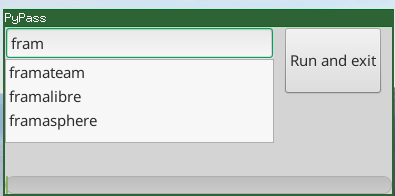

# PyPass

PyPass is a small launcher for searching quickly your password store.

## Installation

It requires [pass](https://www.passwordstore.org/) to be already installed and configured

Install the dependencies, on Debian / Ubuntu / Mint:

    sudo apt install python-gi python-gi-cairo python3-gi python3-gi-cairo gir1.2-gtk-3.0

Put pypass.py somewhere inside tour path and run `pypass.py`

### Notes :

I have not tested PyPass on MacOS it will probably fail on the completion part.

## Screnshots

